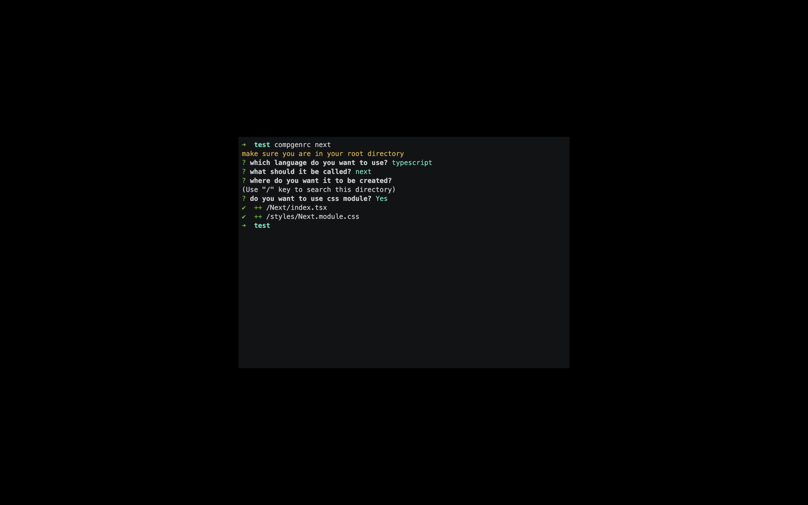

# compgenrc

Simple generator for React, React native and Nextjs Component from command line

[](https://oclif.io)
[](https://npmjs.org/package/compgenrc)
[](https://npmjs.org/package/compgenrc)
[](https://github.com/boubaSambare/compgen/blob/master/package.json)

<!-- toc -->

- [Usage](#usage)
- [Commands](#commands)
<!-- tocstop -->

# Usage

<!-- usage -->

```sh-session
$ npm install -g compgenrc
$ compgenrc COMMAND
running command...
$ compgenrc (-v|--version|version)
compgenrc/1.0.1 darwin-x64 node-v15.12.0
$ compgenrc --help [COMMAND]
USAGE
  $ compgenrc COMMAND
...
```

<!-- usagestop -->

# Commands

<!-- commands -->

- [`compgenrc autocomplete [SHELL]`](#compgenrc-autocomplete-shell)
- [`compgenrc help [COMMAND]`](#compgenrc-help-command)
- [`compgenrc native`](#compgenrc-native)
- [`compgenrc next`](#compgenrc-next)
- [`compgenrc react`](#compgenrc-react)

## `compgenrc autocomplete [SHELL]`

display autocomplete installation instructions

```
USAGE
  $ compgenrc autocomplete [SHELL]

ARGUMENTS
  SHELL  shell type

OPTIONS
  -r, --refresh-cache  Refresh cache (ignores displaying instructions)

EXAMPLES
  $ compgenrc autocomplete
  $ compgenrc autocomplete bash
  $ compgenrc autocomplete zsh
  $ compgenrc autocomplete --refresh-cache
```

_See code: [@oclif/plugin-autocomplete](https://github.com/oclif/plugin-autocomplete/blob/v0.3.0/src/commands/autocomplete/index.ts)_

## `compgenrc help [COMMAND]`

display help for compgenrc

```
USAGE
  $ compgenrc help [COMMAND]

ARGUMENTS
  COMMAND  command to show help for

OPTIONS
  --all  see all commands in CLI
```

_See code: [@oclif/plugin-help](https://github.com/oclif/plugin-help/blob/v3.2.2/src/commands/help.ts)_

## `compgenrc native`

generate react native component

```
USAGE
  $ compgenrc native

OPTIONS
  -f, --force
  -h, --help   show CLI help
```

_See code: [src/commands/native.ts](https://github.com/boubaSambare/compgenrc/blob/v1.0.0/src/commands/native.ts)_

## `compgenrc next`

generate nextjs component

```
USAGE
  $ compgenrc next

OPTIONS
  -f, --force
  -h, --help   show CLI help
```

_See code: [src/commands/next.ts](https://github.com/boubaSambare/compgenrc/blob/v1.0.0/src/commands/next.ts)_

## `compgenrc react`

generate react component

```
USAGE
  $ compgenrc react

OPTIONS
  -f, --force
  -h, --help   show CLI help
```

_See code: [src/commands/react.ts](https://github.com/boubaSambare/compgenrc/blob/v1.0.0/src/commands/react.ts)_

<!-- commandsstop -->
